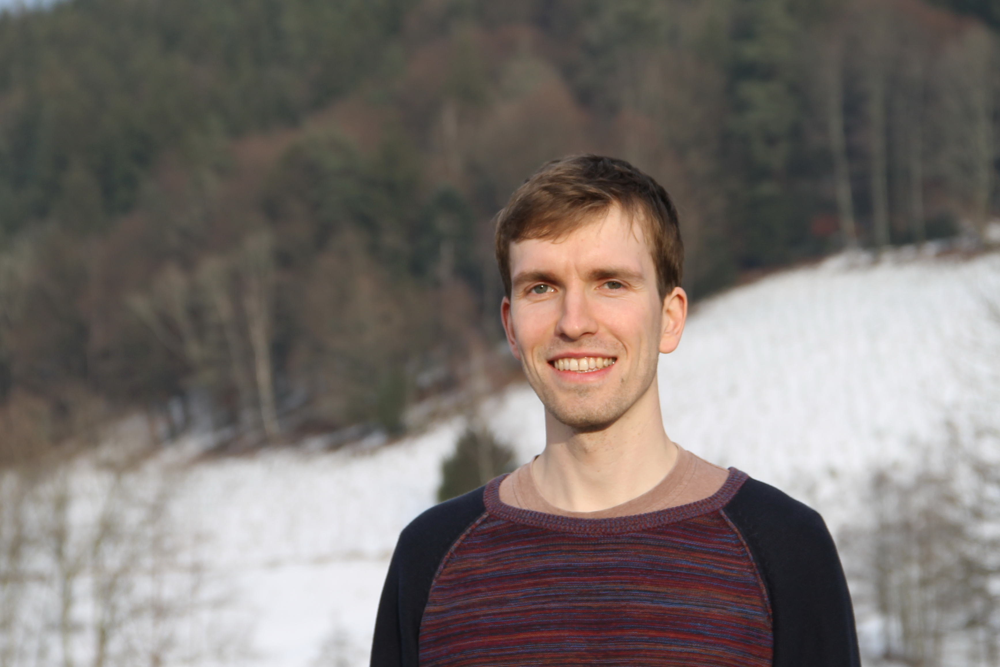

### Welcome!

I am a postdoc in the group of [Amos Tanay](https://www.weizmann.ac.il/math/tanay/) at the Weizmann Institute of Science. Previously, I was a PhD student at the Weierstrass Institute for Applied Analysis and Stochastics, Berlin.  

My current research focuses on understanding the gene regulatory mechanisms during mammalian gastrulation.

You can contact me via [email](mailto:markus.mittnenzweig@weizmann.ac.il).

